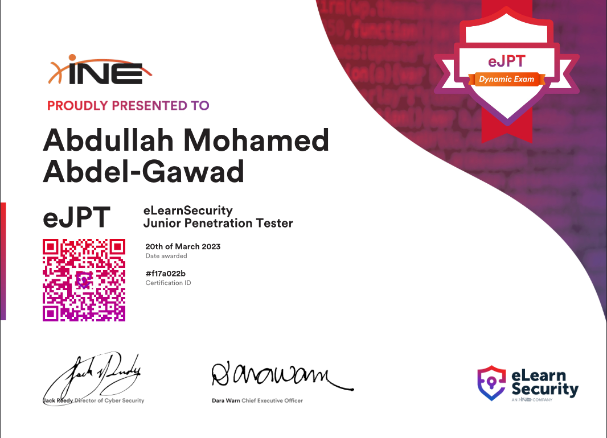

# eJPT

## Intro

These are a collection of my notes for the eLearnSecurity Junior Penetration Tester Certification. Hopefully, they will be as helpful to others as they were for me.

<figure><figcaption>
eJpt v2 Certification
</figcaption></figure>

***

## Table of Contents

* [Networking](networking.md)
* [Penetration Testing](penetration-testing.md)
* [Information Gathering](information-gathering.md)
* [Footprinting & Scanning](scanning.md)
* [Vulnerability Assessment](vulnerability-assesment.md)
* [Web Attacks](web-attacks.md)
* [System Attacks](system-attacks.md)
* [Network Attacks](network-attacks.md)
* [Pivoting](pivoting.md)

***
